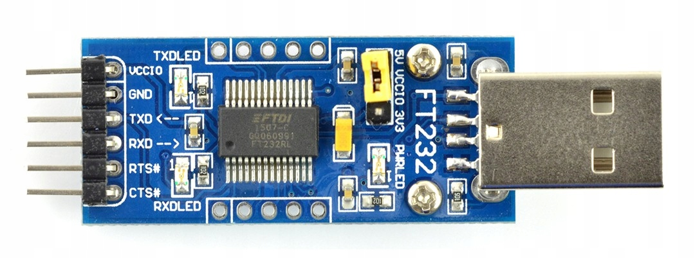
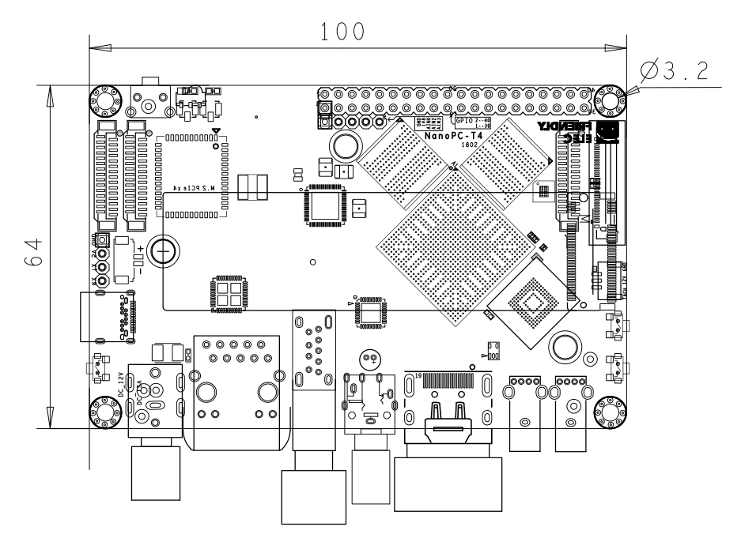

# Description

This document is my collection of notes and links when researching how to run NixOS on [NanoPC-T4](http://wiki.friendlyarm.com/wiki/index.php/NanoPC-T4#System_Login).

# Table of Contents

1\.  [Links](#links)  
2\.  [UART Console](#uartconsole)  
3\.  [Upgrade Tool](#upgradetool)  
3.1\.  [Usage](#usage)  
3.2\.  [Links](#links-1)  
4\.  [U-Boot](#u-boot)  
4.1\.  [Usage](#usage-1)  
4.2\.  [Links](#links-2)  
5\.  [Booting](#booting)  
5.1\.  [Errors](#errors)  
6\.  [Commands](#commands)  
6.1\.  [`extlinux.conf`](#`extlinux.conf`)  
6.2\.  [Failure](#failure)  
6.3\.  [Links](#links-3)  

# Links

General related links:

* https://www.armbian.com/nanopc-t4/
* http://wiki.friendlyarm.com/wiki/index.php/NanoPC-T4
* https://github.com/makefu/ROC-RK3399-PC-overlay
* https://nixos.wiki/wiki/NixOS_on_ARM/Firefly_AIO-3399C
* https://nixos.wiki/wiki/NixOS_on_ARM/PINE64_ROCKPro64

# UART Console

Device provides a Debug UART 4 Pin 2.54mm header connection, 3V level, 1500000bps.

To connect to you will need a USB to UART converterreceiver that supports the speed of 1500000bps.

The serial port parameters are [8-N-1](https://en.wikipedia.org/wiki/8-N-1).

A reader using `CP2102` chip did not work but `FT232RL` works fine:



You can use `minicom` or `picocom` to connect:
```
sudo minicom -b 1500000 -D /dev/ttyUSB0 
sudo picocom -b 1500000 /dev/ttyUSB0
```
But you'll need to disable flow control with `Ctrl-A x`.

Here is a good overview of UART USB-to-Serial adapters:

* https://www.sjoerdlangkemper.nl/2019/03/20/usb-to-serial-uart/
* https://www.ftdichip.com/Support/Documents/DataSheets/ICs/DS_FT232R.pdf

Pin layout where #4 is next to USB-C port:

| Pin num.| #1  | #2 | #3 | #4 |
|---------|-----|----|----|----|
| Purpose | GND | V5 | TX | RX |

Remember that the `TX` and `RX` ports should be swapped between UART adapter and the board.

The V5 pin does not need to be connected if you're powering the board from another source.

See the full board diagram for more details:



You can access the recovery console by holding the __Recovery__ button and then pressing the __Power__ button.
For this to work the device will have to be off, which requires holding the __Power__ button long enough.

# Subsections

Some other notes I made:

* [U-Boot](./UBOOT.md)
* [Upgrade Tool](./UPGRADE_TOOL.md)
