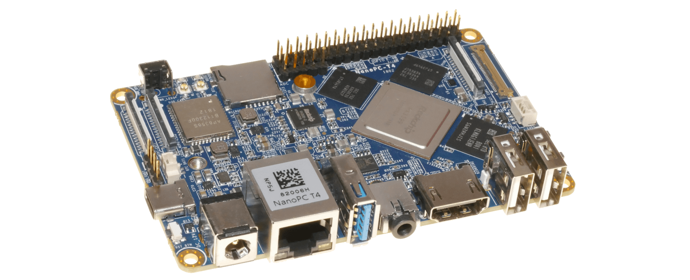

# Description

This document on how I configure [NixOS](https://nixos.org/) on [NanoPC-T4](http://wiki.friendlyarm.com/wiki/index.php/NanoPC-T4#System_Login) and contains my original collection of notes and links when researching how to do this.



# Solution

## Booting

To install NixOS on you can follow the [official instructions](https://nixos.wiki/wiki/NixOS_on_ARM/NanoPC-T4) by downloading the [pre-built images](https://github.com/tmountain/arch-nanopct4/tree/main/images/). You can also build the U-Boot image yourself from `nixpkgs` based on changes added in [#111034](https://github.com/NixOS/nixpkgs/pull/111034).

## NixOS Config

The basic configuration should look something like this:
```nix
{
  # Disable Grub in favor of ExtLinux
  boot.loader.grub.enable = false;
  # Enables the generation of /boot/extlinux/extlinux.conf
  boot.loader.generic-extlinux-compatible.enable = true;
  # Enable additional firmware (such as Wi-Fi drivers).
  hardware.enableRedistributableFirmware = true;
}
```

To make the NVMe SSD be detected at boot compile Rockchip modules directly into the kernel:
```nix
{
  boot.kernelPatches = [{
    name = "pcie-rockchip-config.patch";
    patch = null;
    extraConfig = ''
      PHY_ROCKCHIP_PCIE y
      PCIE_ROCKCHIP_HOST y
    '';
  }];
}
```
For more details see the [PCI NVMe document](./PCIE_NVME.md).

## NixOS on ZFS

My solution was to migrate the OS from the eMMC storage to the NVMe.

I create the ZFS pool and three filesystems on the SSD:
```sh
zpool create -O xattr=sa -O acltype=posixacl -O mountpoint=none rpool /dev/nvme0n1
for vol in nix root home; do
    zfs create -o mountpoint=legacy rpool/$VOL
    mkdir /mnt/$VOL
    mount.zfs rpool/$VOL /mnt/$VOL
done
rsync -rax /. /mnt/root
rsync -rax /nix/. /mnt/nix
rsync -rax /home/. /mnt/home
rsync -rax /boot/. /
```
And I create a configuration that looks something like this:
```
{
  fileSystems."/boot" = { device = "/dev/disk/by-uuid/1234-5678"; fsType = "ext4"; };
  fileSystems."/" = { device = "rpool/root"; fsType = "zfs"; };
  fileSystems."/nix" = { device = "rpool/nix"; fsType = "zfs"; };
  fileSystems."/home" = { device = "rpool/home"; fsType = "zfs"; };
}
```
And rebuild he system:
```sh
sudo nixos-rebuild boot
```
After that it's necessary to run all the four `rsync` commands again to sync filesystems.

Once everything is synced you can finally reboot.

# Notes

* [UART Console](./UART.md)
* [U-Boot](./UBOOT.md)
* [Upgrade Tool](./UPGRADE_TOOL.md)
* [PCI NVMe](./PCIE_NVME.md)
* [Logs](./logs/README.md)
* [Links](./LINKS.md)
